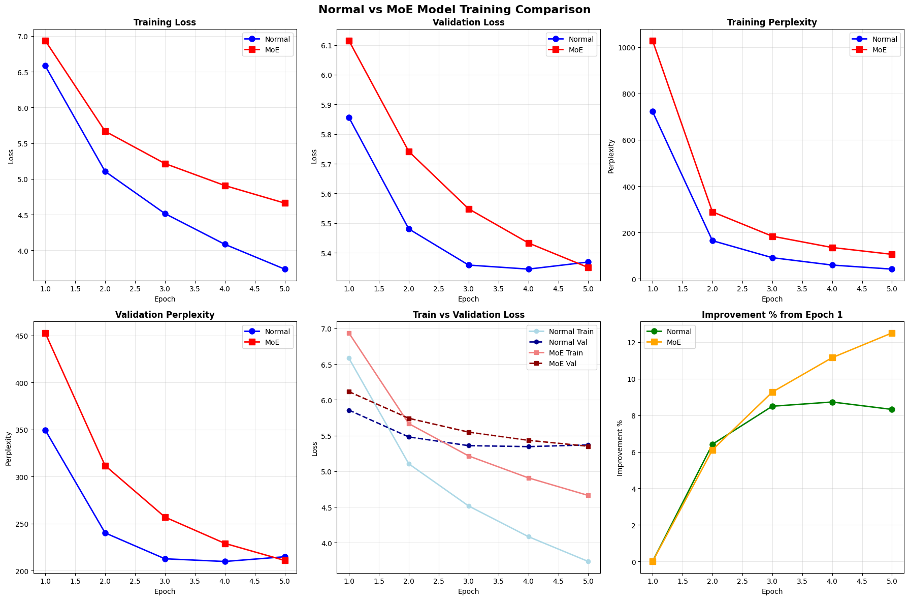
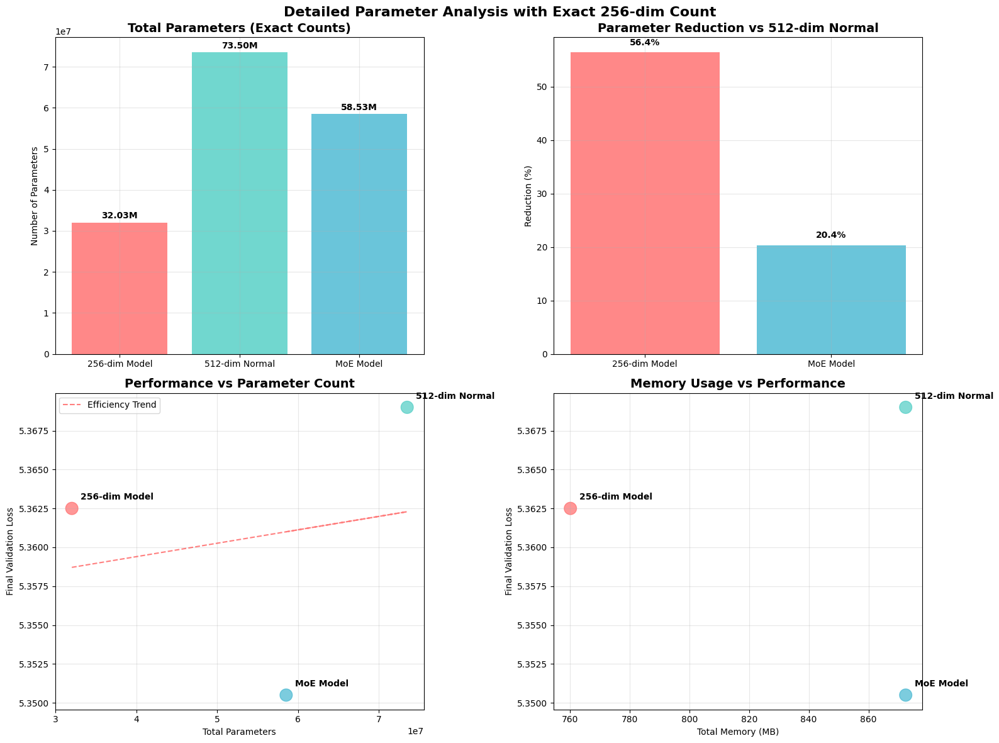
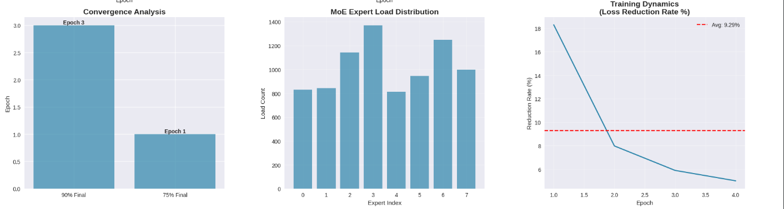

# Conditional Per-Token Embedding Compression via Mixture-of-Experts Routing

**An empirical ablation study on whether expert-routed compression outperforms static dimensionality reduction in transformer language models.**

Author: Lakshmeesha N
Status: Early-stage ablation · Small-scale (WikiText-2) · Seeking collaboration for large-scale validation

---

## 1. Motivation

Transformers keep the model dimension (`d_model`) fixed across every layer, so attention and feed-forward computation scale with the full embedding width for *every* token, regardless of how much information that token actually requires. Standard efficiency techniques address this **statically and uniformly**:

- A single dense matrix (ALBERT-style factorized embeddings) projects all tokens through the same fixed transformation.
- A shared low-rank subspace (e.g., Linformer, Projected Compression) reduces width identically for every token.

This project asks a narrower, testable question:

> **Does routing each token through a specialized compression expert (mixture-of-experts) — instead of a single shared projection — produce a better compute/quality trade-off at a matched target dimension?**

The hypothesis is that different tokens may carry different amounts of "compressible" information, and a router that conditions compression on token identity/context could preserve more signal than a one-size-fits-all matrix.

---

## 2. Method

Three architectures are compared, all trained from scratch under matched training conditions:

| Model | Description |
|---|---|
| **512-dim (Normal)** | Standard transformer, `d_model = 512` throughout. Upper-bound quality reference. |
| **256-dim (Plain)** | Standard transformer, `d_model = 256` throughout. Cheap baseline — no compression mechanism, just a smaller model. |
| **MoE (512→256)** | Token embeddings computed at 512-dim, then routed through a mixture-of-experts layer (8 experts, top-k routing) that compresses each token to 256-dim before all downstream attention/FFN computation. |

**Dataset:** WikiText-2
**Training:** 5 epochs, identical optimizer/schedule across all three arms
**Compute:** Single consumer/free-tier GPU (Google Colab) — a hard constraint on this study's scale, discussed in [Limitations](#6-limitations--future-work).

---

## 3. Results

### 3.1 Summary Table

| Model | Total Parameters | Memory (MB) | Final Val Loss | Final Val PPL | Training Speed | Params vs. 512-dim |
|---|---:|---:|---:|---:|---:|---:|
| **256-dim (Plain)** | 32,031,104 | 760.1 | **5.3625** | **213.26** | 3.39 it/s | −56.4% |
| **512-dim (Normal)** | 73,499,008 | 872.5 | 5.3690 | 214.64 | 2.41 it/s | baseline |
| **MoE (512→256)** | 58,534,528 | 872.5 | 5.3505 | 210.72 | 2.88 it/s | −20.4% |

### 3.2 Training Curves



### 3.3 Parameter & Memory Efficiency



### 3.4 Router Behavior

The MoE router's load distribution across its 8 experts was inspected to confirm it does not collapse to a single dominant expert (a common MoE failure mode):



Load is imbalanced but not collapsed — expert 3 receives the most tokens (~1,380) and expert 4 the fewest (~820), roughly a 1.7× spread. This confirms the router is making non-trivial, differentiated routing decisions rather than defaulting to one expert.

---

## 4. Analysis

**Performance.** The MoE model achieves the lowest validation perplexity of the three (210.72), a **1.8% improvement over the full 512-dim model** and **1.2% improvement over the plain 256-dim model**. This is a genuine, if modest, quality edge.

**Efficiency.** The plain 256-dim model is the more efficient architecture overall. It matches (in fact marginally exceeds in this run) the full 512-dim model's validation performance — retaining **100.1%** of 512-dim quality — while using **56.4% fewer parameters** and **~13% less memory** than the MoE model. The MoE model, despite its routing mechanism, still carries **near-full 512-dim memory cost** (872.5 MB, identical to the 512-dim baseline), because all experts' parameters must remain resident even though only a subset activates per token.

**Overfitting.** Both models show a growing train/validation gap; the Normal (512-dim) model overfits more severely (train loss reaches 3.74 vs. validation 5.37) than the MoE model (train loss 4.66 vs. validation 5.35), suggesting the routing mechanism may have a mild regularizing effect at this scale — though this is a secondary, unconfirmed observation, not the primary hypothesis.

**Honest conclusion.** At this scale, **plain dense dimensionality reduction is the more efficient choice.** It achieves equal-or-better performance than both the full model and the MoE model, at the lowest parameter and memory cost. The MoE approach's quality edge over the 256-dim baseline (1.2% PPL) does not currently justify its added complexity and memory overhead (+15% parameters, +15% memory) at this scale. This is treated here as a genuine, reportable finding — not a result to be minimized.

---

## 5. Comparison to Related Work

| Work | Mechanism | Key Difference from This Study |
|---|---|---|
| **ALBERT** (Lan et al., 2019) | Static factorized embedding, shared across all tokens | No conditional/per-token routing |
| **Linformer** (Wang et al., 2020) | Low-rank projection of the attention computation | Targets sequence-length complexity, not per-token embedding width |
| **Perceiver / Perceiver IO** (Jaegle et al., 2021) | Cross-attention into a fixed latent bottleneck | Compresses sequence length, not per-token channel width |
| **Switch Transformer** (Fedus et al., 2021) | MoE routing at constant width, for specialization | Routes *computation*, not *dimensionality* |
| **Mixture of Hidden-Dimensions Transformer** (2024) | Expands hidden width with sparse conditional activation | Opposite direction — expansion, not compression |
| **Projected Compression** (2025) | Global trainable projection into lower-dim Transformer | Direct baseline analog to our 256-dim (Plain) arm — no routing |
| **This work** | MoE-routed *compression* (512→256), per-token | Combines conditional routing with dimensionality reduction directly |

A search of the closest prior work confirms this specific combination — per-token expert-routed compression, replacing the standard dense compression matrix — has not been directly reported in the literature.

---

## 6. Limitations & Future Work

This is an honest, early-stage result and should be read as such:

- **Scale.** Trained only on WikiText-2 (~2M tokens), a small dataset by modern standards, using a single free-tier GPU. MoE architectures typically require larger, more diverse data to realize their specialization advantage — this study may be underpowered to detect it.
- **Single run.** Results reflect one training run per architecture. No variance/seed analysis has yet been performed; a conclusion drawn from single runs should be treated as preliminary.
- **Router configuration.** Only one routing configuration (8 experts, top-k as implemented) was tested; router capacity, number of experts, and top-k value are all unexplored hyperparameters that could change the outcome.
- **Next steps, compute permitting:**
  1. Repeat all three arms with 3+ random seeds to establish statistical confidence.
  2. Scale to WikiText-103 or a comparable mid-size corpus.
  3. Sweep expert count and routing top-k.
  4. Profile actual wall-clock inference cost, not just parameter/memory counts, since routing overhead is not fully captured by parameter count alone.

This project is compute-constrained at the individual level, which is the primary motivation for seeking guidance and larger-scale resources through academic collaboration.

---

## 7. Repository Structure

```
moe-embedding-compression/
├── README.md
├── notebooks/
│   ├── 01_dim256_baseline.ipynb      # 256-dim plain model
│   └── 02_moe_vs_dim512.ipynb        # MoE (512→256) + full 512-dim baseline
└── results/
    ├── training_comparison.png
    ├── parameter_analysis.png
    └── expert_load_distribution.png
```

## 8. Reproducing

Open either notebook in Google Colab and run all cells top to bottom. All dependencies are declared in the first cell of each notebook.

## 9. Contact

Lakshmeesha N — lakshmeeshan1234@gmail.com — [GitHub](https://github.com/Lakshmeesha-N) — [LinkedIn](https://www.linkedin.com/in/lakshmeesha--n/)

Open to guidance, collaboration, and access to larger-scale compute to validate whether these findings hold at scale.
